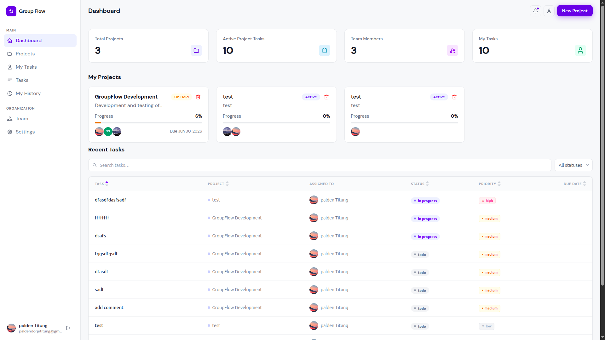
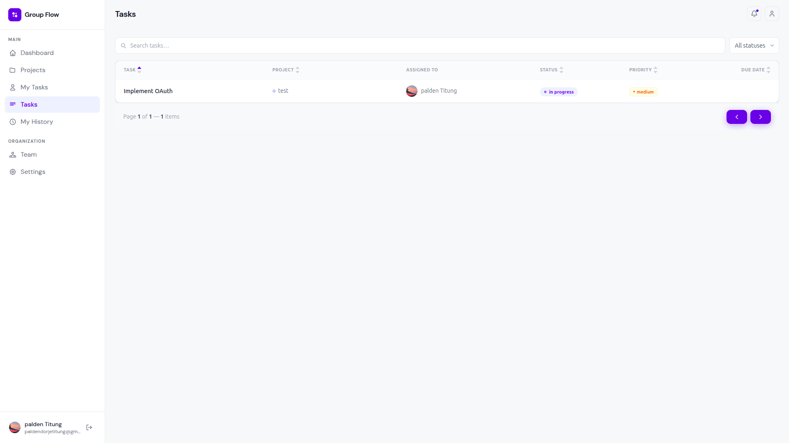
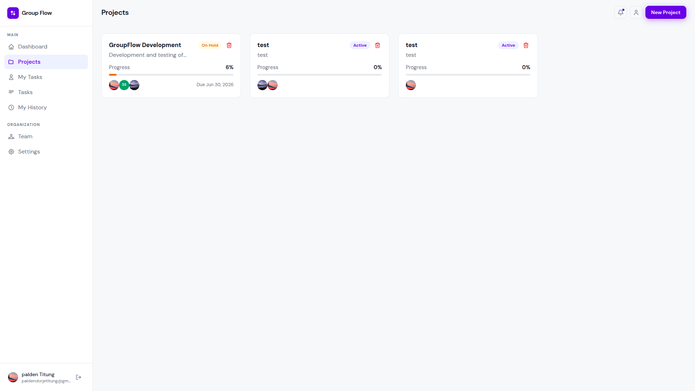

# 🗂️ GroupFlow

A full-stack MERN project management app for team collaboration. Users can create projects, invite members, assign tasks, track activity through an audit log, and discuss work through per-task comments — all backed by real-time-feeling notifications and a fully Dockerized setup.

---

## Screenshots

| Dashboard                                         | Task Board                                | Project View                                    |
| ------------------------------------------------- | ----------------------------------------- | ----------------------------------------------- |
|  |  |  |

---

## Features

- **Auth** — Register, login, email verification, forgot/reset password.
- **Projects** — Create and manage projects, invite members via email.
- **Tasks** — Assign tasks, update status, accept or reject assignments.
- **Comments** — Per-task comment threads for discussing work in context.
- **History** — Project-wide audit log recording who did what and when, across tasks, members, and project changes.
- **Notifications** — User-specific alerts with read/unread state.
- **Profile** — Avatar upload and account settings.
- **Docker** — Fully containerized, runs with a single command.

---

## Tech Stack

| Layer         | Technology                      |
| ------------- | ------------------------------- |
| Frontend      | React 18, Vite, Tailwind CSS    |
| Backend       | Node.js, Express.js             |
| Database      | MongoDB, Mongoose               |
| Auth          | JWT, bcrypt                     |
| Email         | Nodemailer (Gmail App Password) |
| Image Storage | Cloudinary                      |
| DevOps        | Docker, Docker Compose          |

---

## Project Structure

```
groupflow/
├── backend/
│   ├── modules/        # auth, users, projects, tasks, comments, history, notifications, members
│   ├── middleware/     # auth, error, upload, validation
│   ├── utils/          # email, rate limiter, error handler, etc.
│   └── server.js
├── frontend/
│   ├── src/
│   │   ├── pages/      # all route-level pages
│   │   ├── components/ # reusable UI components
│   │   ├── hooks/      # custom hooks per feature
│   │   ├── contexts/   # global state (auth, projects, tasks, etc.)
│   │   └── services/   # API call functions per module
│   └── index.html
└── docker-compose.yml
```

---

## Getting Started

### Prerequisites

- [Docker](https://www.docker.com/) and Docker Compose
- A MongoDB instance — local or [MongoDB Atlas](https://www.mongodb.com/atlas)
- A Gmail account with a configured [App Password](https://support.google.com/accounts/answer/185833) for email features
- A [Cloudinary](https://cloudinary.com/) account for image uploads

### 1. Clone the repo

```bash
git clone https://github.com/paldentitung/GroupFlow.git
cd GroupFlow
```

### 2. Configure environment variables

Both `backend` and `frontend` have a `.env.example` file. Which one you fill in depends on how you plan to run the app:

| File               | Used for                     |
| ------------------ | ---------------------------- |
| `.env.development` | Manual `npm run dev`         |
| `.env.production`  | Docker (`docker-compose up`) |

Keeping these separate means a Docker run and a local dev run can point at different databases, URLs, or credentials without one config clobbering the other.

> ⚠️ Never commit `.env.development` or `.env.production` — they contain real secrets. The `.env.example` files are safe to commit and serve as a reference.

**Backend:**

```bash
# For local dev
cp ./backend/.env.example ./backend/.env.development

# For Docker
cp ./backend/.env.example ./backend/.env.production
```

Then fill in the values:

```env
# Server
PORT=8000

# Database — use your local or Atlas connection string
MONGO_URI=mongodb://127.0.0.1:27017/groupflow

# Auth — any long random string
JWT_SECRET=your_jwt_secret

# URLs
CLIENT_URL=http://localhost:5173
BASE_URL=http://localhost:8000

# Email — Gmail address + App Password (not your real Gmail password)
EMAIL_USER=your_email@gmail.com
EMAIL_PASS=your_gmail_app_password

# Cloudinary — get these from your Cloudinary dashboard
CLOUDINARY_CLOUD_NAME=your_cloud_name
CLOUDINARY_API_KEY=your_api_key
CLOUDINARY_API_SECRET=your_api_secret
```

**Frontend:**

```bash
# For local dev
cp ./frontend/.env.example ./frontend/.env.development

# For Docker
cp ./frontend/.env.example ./frontend/.env.production
```

Then fill in:

```env
# Points to your running backend
VITE_API_URL=http://localhost:8000/api
```

### 3. Run with Docker 🐳

```bash
docker-compose up --build
```

| Service  | URL                   |
| -------- | --------------------- |
| Frontend | http://localhost:4173 |
| Backend  | http://localhost:8000 |

### 4. Run manually (without Docker)

**Backend:**

```bash
cd backend
npm install
npm run dev
```

**Frontend:**

```bash
cd frontend
npm install
npm run dev
```

Frontend runs on `http://localhost:5173` in dev mode.

---

## API Overview

All endpoints are prefixed with `/api`.

| Module        | Base Route           |
| ------------- | -------------------- |
| Auth          | `/api/auth`          |
| Users         | `/api/users`         |
| Projects      | `/api/projects`      |
| Tasks         | `/api/tasks`         |
| Members       | `/api/members`       |
| Comments      | `/api/comments`      |
| History       | `/api/history`       |
| Notifications | `/api/notifications` |

---

## Challenges & Decisions

- **Implementing Socket.io** — Getting real-time notifications working was one of the trickier parts of the build. The initial setup had the socket connection firing before the auth context had finished hydrating, so events would occasionally get missed on first load. It also took some trial and error to figure out how to scope rooms per authenticated user so notifications only went to the right person instead of broadcasting more broadly. Settled on delaying socket initialization until auth state was confirmed, then joining a user-specific room right after connecting.

- **Global state management** — With auth, projects, tasks, and notifications all needing to be accessible across different parts of the app, deciding how to structure global state took some iteration. Putting everything in one large context led to unrelated components re-rendering whenever any piece of state changed. Splitting state into separate contexts per domain (auth, projects, tasks, notifications) fixed the unnecessary re-renders, at the cost of needing to compose multiple providers at the root of the app.

---

## Future Improvements

- **Live deployment** — Deploy to Railway (backend) and Vercel (frontend).
- **TypeScript** — Migrate the frontend to TypeScript for better type safety and DX.
- **Cloudinary migration** — Move all avatar/image storage fully to Cloudinary (currently local uploads for some assets).

---

## License

MIT License
